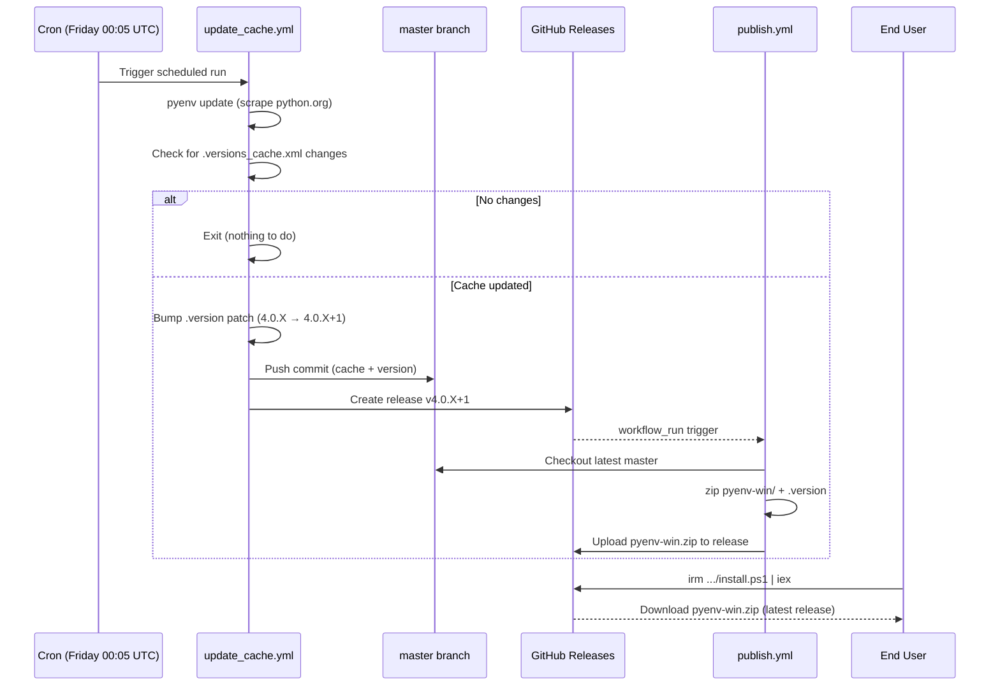
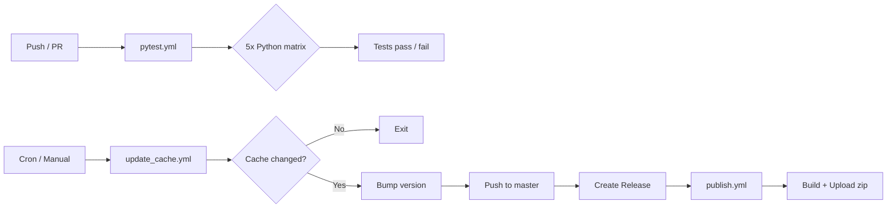

# CI/CD Workflows

## Overview

| Workflow           | Trigger                                           | Runner  | Purpose                                            |
| ------------------ | ------------------------------------------------- | ------- | -------------------------------------------------- |
| `pytest.yml`       | Push (any branch), PR to master, manual           | Windows | Run test suite across Python 3.8–3.12              |
| `update_cache.yml` | Weekly (Friday 00:05 UTC), manual                 | Windows | Refresh `.versions_cache.xml` from python.org      |
| `publish.yml`      | After `update_cache` completes, or manual release | Ubuntu  | Build and upload `pyenv-win.zip` to GitHub Release |

## Workflow Details

### pytest.yml — Test Suite

Runs on every push and PR. Executes pytest with coverage across a matrix of five Python versions (3.8, 3.9, 3.10, 3.11, 3.12) on Windows. All matrix jobs run independently (`fail-fast: false`).

### update_cache.yml — Weekly Version Cache Update

Runs `pyenv update` to scrape python.org for new Python releases. If `.versions_cache.xml` changes:

1. Bumps the patch version in `.version` (e.g. `4.0.3` → `4.0.4`)
2. Commits both files directly to `master`
3. Creates a GitHub Release (`v4.0.4`)

If no new Python versions are found, the workflow exits without changes.

### publish.yml — Build & Attach Release Zip

Triggered by `workflow_run` after `update_cache.yml` completes successfully, or when a release is manually created. Builds `pyenv-win.zip` (containing `pyenv-win/` and `.version`) and uploads it as a release asset. This is the zip that `install.ps1` downloads.

## End-to-End Flow

