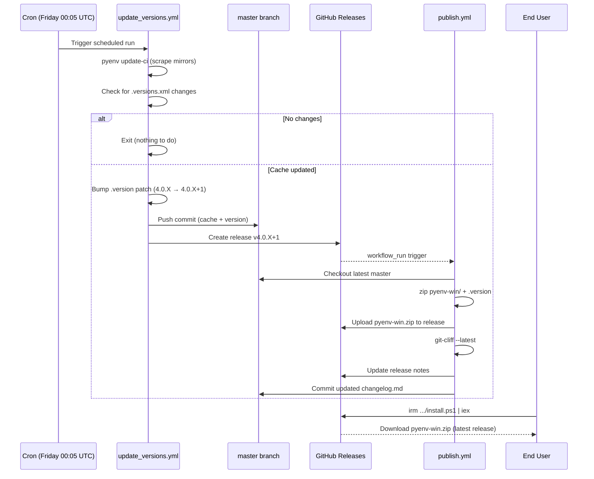
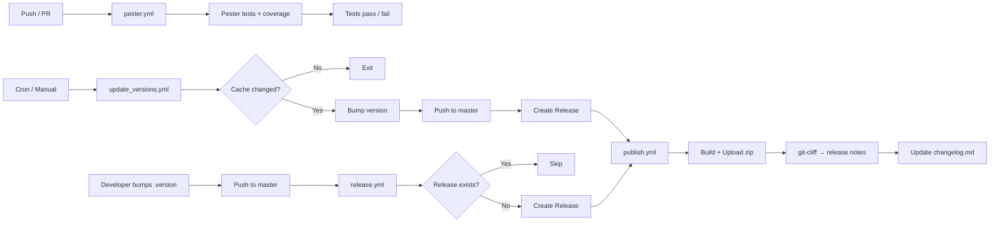
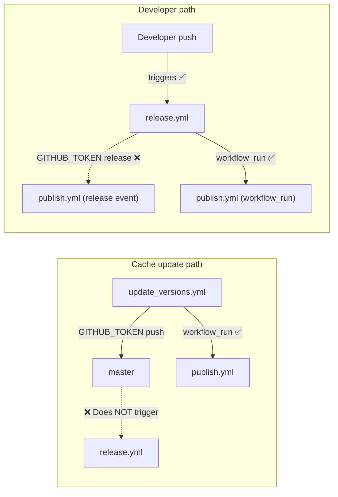

# CI/CD Workflows

## Overview

| Workflow           | Trigger                                                         | Runner  | Purpose                                            |
| ------------------ | --------------------------------------------------------------- | ------- | -------------------------------------------------- |
| `pester.yml`       | Push (any branch), PR to master, manual                         | Windows | Run Pester test suite with code coverage           |
| `update_versions.yml` | Weekly (Friday 00:05 UTC), manual                               | Windows | Refresh `.versions.xml` via `update-ci`    |
| `release.yml`      | Push to master that changes `.version`                          | Ubuntu  | Create GitHub Release from version bump            |
| `publish.yml`      | After `update_versions` or `release` completes, or release created | Ubuntu  | Build and upload `pyenv-win.zip` to GitHub Release |

## Workflow Details

### pester.yml — Test Suite

Runs on every push and PR. Installs Pester 5.7+ and executes all `*.Tests.ps1` files in `tests/` via `Run-Tests.ps1` on Windows. Produces JaCoCo code coverage and NUnit XML test results, uploaded as workflow artifacts.

### update_versions.yml — Weekly Version Cache Update

Runs `pyenv update-ci` (a hidden CI-only command) to scrape python.org, PyPy, and GraalPy for new installer releases. If `.versions.xml` changes:

1. Bumps the patch version in `.version` (e.g. `4.0.3` → `4.0.4`)
2. Commits both files directly to `master`
3. Creates a GitHub Release (`v4.0.4`)

If no new Python versions are found, the workflow exits without changes.

### release.yml — Auto-Release on Version Bump

Triggered on push to `master` when `.version` changes. Reads the version, checks whether a matching release already exists (to avoid duplicates from `update_versions`), and creates a GitHub Release if needed. This automates the code-change release path — just bump `.version`, commit, and push.

> **Note:** Pushes made by `update_versions.yml` use `GITHUB_TOKEN`, which does not trigger other workflows. So this workflow only fires for developer pushes, not automated cache updates.

### publish.yml — Build & Attach Release Zip

Triggered by `workflow_run` after `update_versions.yml` or `release.yml` completes successfully, or when a release is created manually. Steps:

1. Builds `pyenv-win.zip` (containing `pyenv-win/` and `.version`) and uploads it as a release asset
2. Runs [git-cliff](https://git-cliff.org/) to generate release notes from conventional commits
3. Updates the GitHub Release with the generated notes
4. Prepends the new version section to `docs/changelog.md` and commits to master

Configuration for git-cliff lives in `cliff.toml` at the repo root.

## End-to-End Flow

### Sequence: Automated Cache Update → Release → Install

Shows the full lifecycle from scheduled cache scrape through zip delivery to end users.

### Flowchart: All Workflow Triggers

Overview of every CI/CD path — testing, automated cache releases, and developer-initiated releases.

## Release Scenarios

| Scenario            | Who bumps `.version`? | Who creates release?  | Who uploads zip? |
| ------------------- | --------------------- | --------------------- | ---------------- |
| New Python versions | `update_versions` (auto) | `update_versions` (auto) | `publish` (auto) |
| Code changes        | Developer (manual)    | `release.yml` (auto)  | `publish` (auto) |
| Manual release      | Developer (manual)    | Developer (manual)    | `publish` (auto) |

## Token Anti-Recursion

GitHub's `GITHUB_TOKEN` has a built-in safety rule: actions performed with it **do not trigger other workflows**. This project relies on that behavior to prevent infinite loops, and uses `workflow_run` as the workaround to chain workflows intentionally.

- **Cache path:** `update_versions` pushes with `GITHUB_TOKEN`, so `release.yml` does **not** fire (no duplicate release). `publish.yml` runs via `workflow_run`.
- **Developer path:** A developer push **does** trigger `release.yml`. The release it creates with `GITHUB_TOKEN` won't trigger `publish.yml`'s `release: created` event, but `publish.yml` still runs via `workflow_run`.
